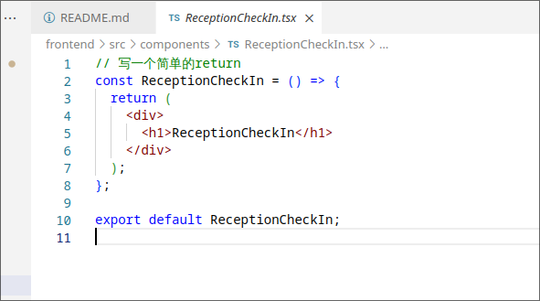
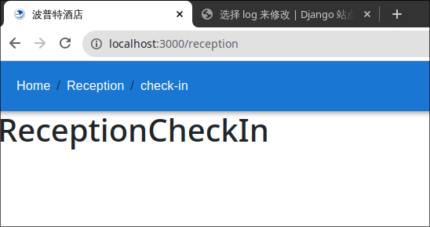
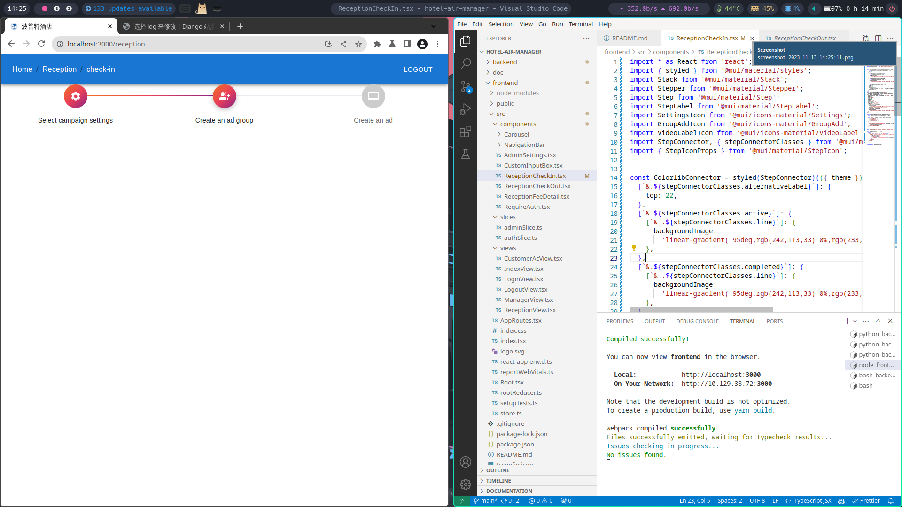
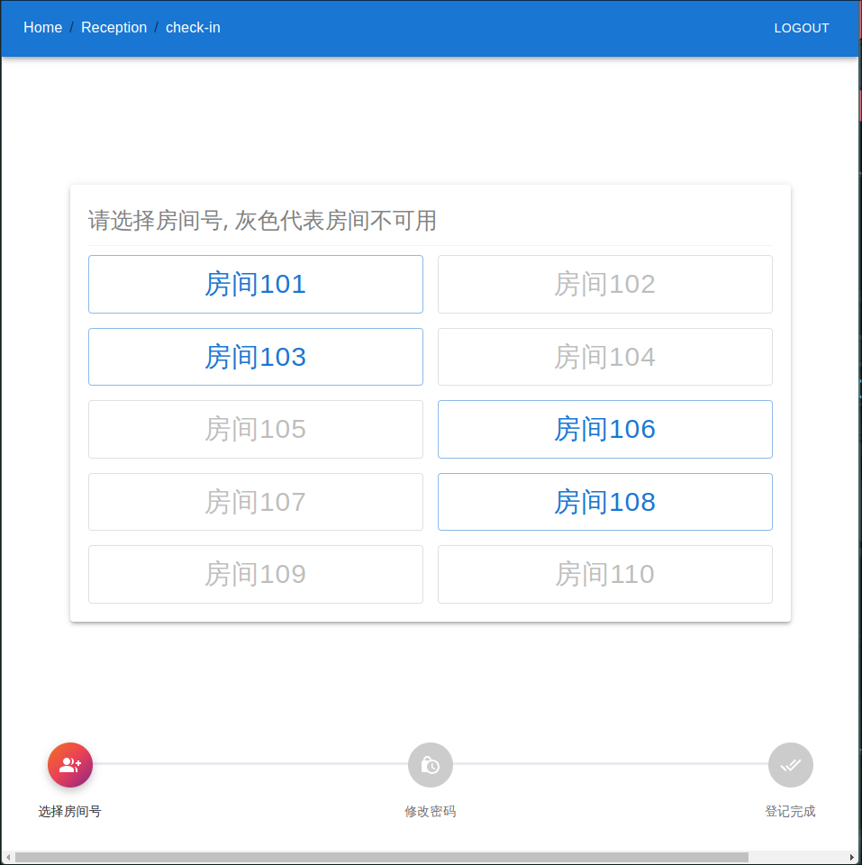
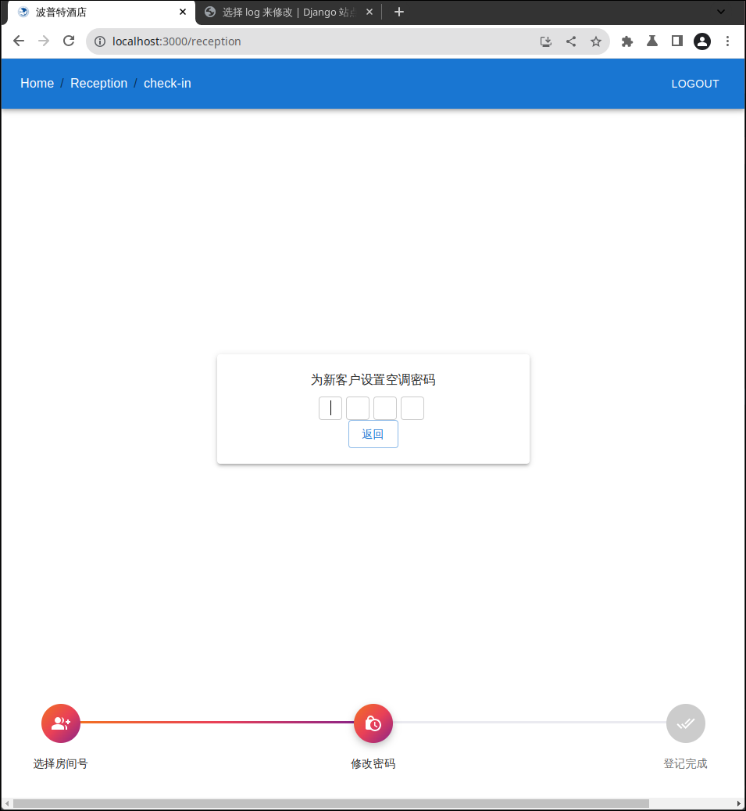
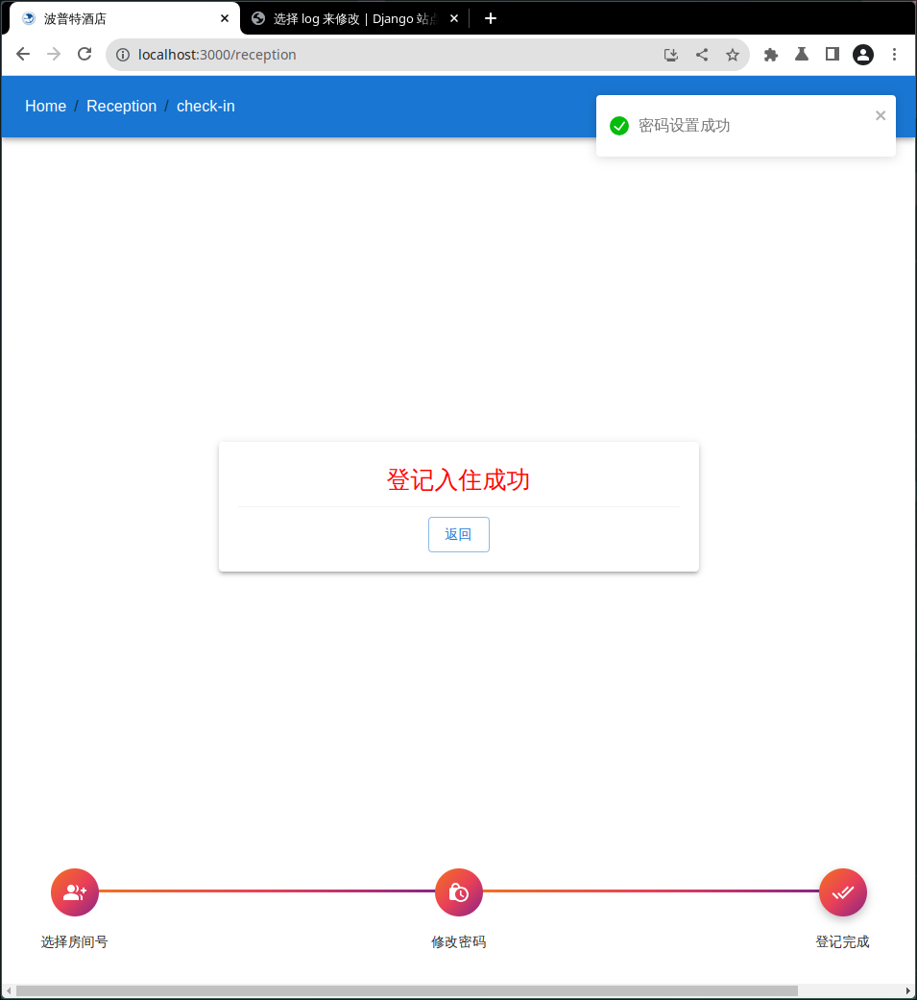
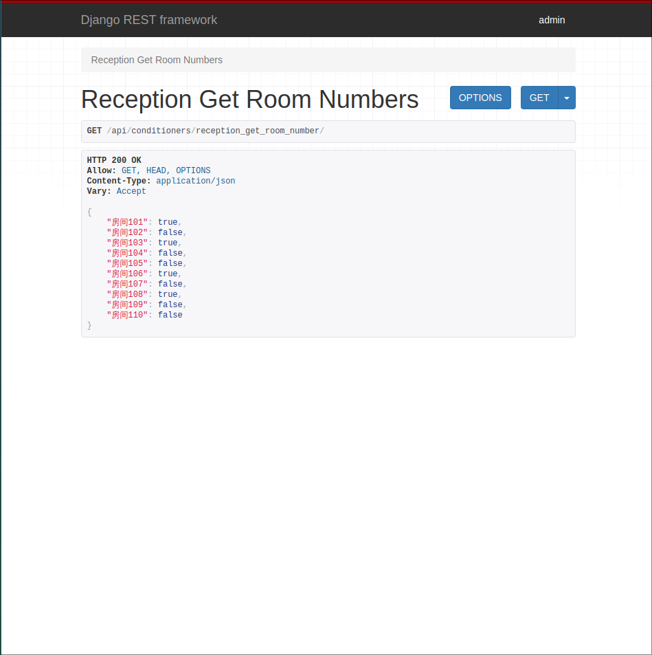
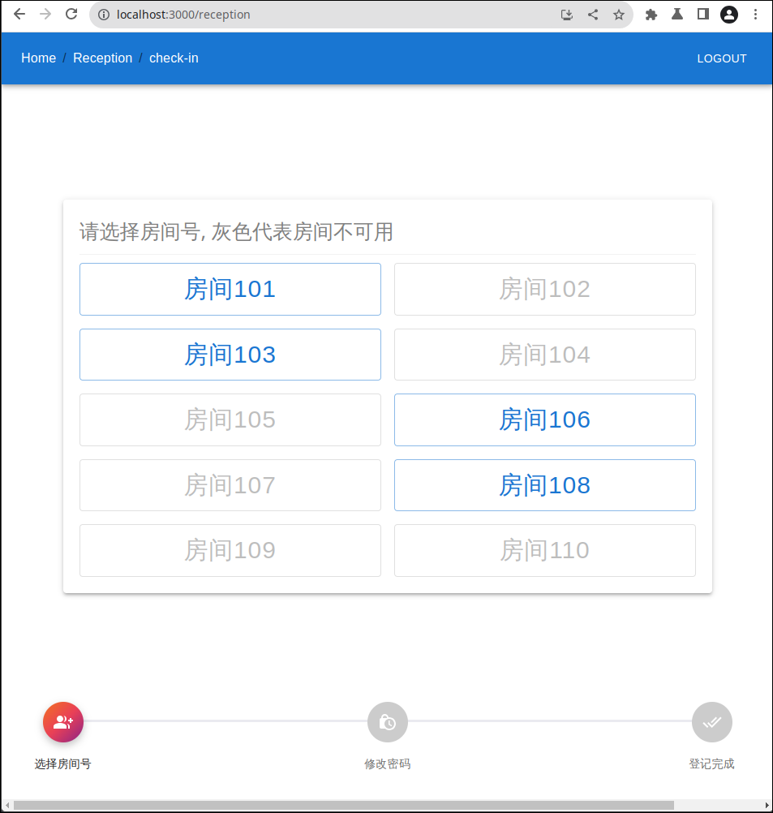

用入住登记给你做个示范</br>
找到这个路径下的文件,frontend/src/components/ReceptionCheckIn.tsx

</br>目前它在前端渲染的效果是ReceptionCheckIn这几个字:</br>

</br>你要做的是修改这个文件,比如我通过mui官网复制了一段stepper的代码,然后把它粘贴到了这个文件里,然后你就可以在localhost:3000/ReceptionCheckIn,点击checkIn看到效果了

再借助chatgpt和自己的修改,最后如下
```
import * as React from "react";
import { styled } from "@mui/material/styles";
import Stack from "@mui/material/Stack";
import Stepper from "@mui/material/Stepper";
import Step from "@mui/material/Step";
import StepLabel from "@mui/material/StepLabel";
import GroupAddIcon from "@mui/icons-material/GroupAdd";
import DoneAllIcon from "@mui/icons-material/DoneAll";
import LockClockIcon from "@mui/icons-material/LockClock";
import StepConnector, {
  stepConnectorClasses,
} from "@mui/material/StepConnector";
import { StepIconProps } from "@mui/material/StepIcon";
import { Button, Grid, Input, Paper, TextField } from "@mui/material";
import { toast } from "react-toastify";
import { ChangeEvent, useRef, useState } from "react";

const ColorlibConnector = styled(StepConnector)(({ theme }) => ({
  [`&.${stepConnectorClasses.alternativeLabel}`]: {
    top: 22,
  },
  [`&.${stepConnectorClasses.active}`]: {
    [`& .${stepConnectorClasses.line}`]: {
      backgroundImage:
        "linear-gradient( 95deg,rgb(242,113,33) 0%,rgb(233,64,87) 50%,rgb(138,35,135) 100%)",
    },
  },
  [`&.${stepConnectorClasses.completed}`]: {
    [`& .${stepConnectorClasses.line}`]: {
      backgroundImage:
        "linear-gradient( 95deg,rgb(242,113,33) 0%,rgb(233,64,87) 50%,rgb(138,35,135) 100%)",
    },
  },
  [`& .${stepConnectorClasses.line}`]: {
    height: 3,
    border: 0,
    backgroundColor:
      theme.palette.mode === "dark" ? theme.palette.grey[800] : "#eaeaf0",
    borderRadius: 1,
  },
}));

const ColorlibStepIconRoot = styled("div")<{
  ownerState: { completed?: boolean; active?: boolean };
}>(({ theme, ownerState }) => ({
  backgroundColor:
    theme.palette.mode === "dark" ? theme.palette.grey[700] : "#ccc",
  zIndex: 1,
  color: "#fff",
  width: 50,
  height: 50,
  display: "flex",
  borderRadius: "50%",
  justifyContent: "center",
  alignItems: "center",
  ...(ownerState.active && {
    backgroundImage:
      "linear-gradient( 136deg, rgb(242,113,33) 0%, rgb(233,64,87) 50%, rgb(138,35,135) 100%)",
    boxShadow: "0 4px 10px 0 rgba(0,0,0,.25)",
  }),
  ...(ownerState.completed && {
    backgroundImage:
      "linear-gradient( 136deg, rgb(242,113,33) 0%, rgb(233,64,87) 50%, rgb(138,35,135) 100%)",
  }),
}));

function ColorlibStepIcon(props: StepIconProps) {
  const { active, completed, className } = props;

  const icons: { [index: string]: React.ReactElement } = {
    1: <GroupAddIcon />,
    2: <LockClockIcon />,
    3: <DoneAllIcon />,
  };

  return (
    <ColorlibStepIconRoot
      ownerState={{ completed, active }}
      className={className}
    >
      {icons[String(props.icon)]}
    </ColorlibStepIconRoot>
  );
}

const steps = ["选择房间号", "修改密码", "登记完成"];

const ReceptionCheckIn = () => {
  const [activeStep, setActiveStep] = useState(0);
  const roomNumber = {
    房间101: true,
    房间102: false,
    房间103: true,
    房间104: false,
    房间105: false,
    房间106: true,
    房间107: false,
    房间108: true,
    房间109: false,
    房间110: false,
  };
  const [password, setPassword] = useState(["", "", "", ""]);
  const inputRefs = useRef<Array<HTMLInputElement | null>>([
    null,
    null,
    null,
    null,
  ]);

  const [activeBox, setActiveBox] = useState(0);

  const handlePasswordChange = (index: number, value: string) => {
    const newPassword = [...password];
    newPassword[index] = value;
    setPassword(newPassword);

    if (newPassword.every((val) => val !== "")) {
      toast.success("密码设置成功");
      setActiveStep((prevActiveStep) => prevActiveStep + 1);
    }

    if (value && index < 3) {
      inputRefs.current[index + 1]?.focus();
    }
  };

  const handleKeyDown = (
    index: number,
    e: React.KeyboardEvent<HTMLInputElement>,
  ) => {
    if (e.key === "Backspace" && index > 0 && password[index] === "") {
      const newPassword = [...password];
      newPassword[index - 1] = "";
      setPassword(newPassword);
      inputRefs.current[index - 1]?.focus();
    } else if (e.key === "ArrowLeft" && index > 0) {
      inputRefs.current[index - 1]?.focus();
    } else if (e.key === "ArrowRight" && index < 3) {
      inputRefs.current[index + 1]?.focus();
    }
  };

  const handleBack = () => {
    setActiveStep(0);
    setPassword(["", "", "", ""]);
  };

  const handleButtonClick = (room: string) => {
    setActiveStep((prevActiveStep) => prevActiveStep + 1);
    console.log(room);
  };

  return (
    <div
      style={{
        display: "flex",
        flexDirection: "column",
        alignItems: "center",
        justifyContent: "center",
        height: "80vh",
      }}
    >
      {/* 放置其他内容 */}
      {activeStep === 0 && (
        <Paper
          elevation={3}
          style={{ padding: "20px", width: "800px", textAlign: "center" }}
        >
          <div
            style={{
              color: "gray",
              textAlign: "left",
              marginBottom: "10px",
              fontSize: "25px",
            }}
          >
            请选择房间号, 灰色代表房间不可用
          </div>
          <hr
            style={{
              border: "none",
              borderTop: "1px solid #ccc",
              margin: "10px 0",
            }}
          />
          <Grid container spacing={2}>
            {Object.entries(roomNumber).map(([room, isClickable]) => (
              <Grid item key={room} xs={6}>
                <Button
                  variant="outlined"
                  onClick={() => handleButtonClick(room)}
                  disabled={!isClickable}
                  fullWidth
                  style={{ fontSize: "30px" }}
                >
                  {room}
                </Button>
              </Grid>
            ))}
          </Grid>
        </Paper>
      )}
      {activeStep === 1 && (
        <Paper
          elevation={3}
          style={{ padding: "20px", width: "400px", textAlign: "center" }}
        >
          <div style={{ fontSize: "16px", marginBottom: "10px" }}>
            为新客户设置空调密码
          </div>
          <div style={{ display: "flex", justifyContent: "center" }}>
            {Array.from({ length: 4 }).map((_, index) => (
              <input
                key={index}
                type="text"
                maxLength={1}
                value={password[index]}
                onChange={(e: ChangeEvent<HTMLInputElement>) =>
                  handlePasswordChange(index, e.target.value)
                }
                onKeyDown={(e: React.KeyboardEvent<HTMLInputElement>) =>
                  handleKeyDown(index, e)
                }
                style={{
                  width: "30px",
                  height: "30px",
                  textAlign: "center",
                  marginRight: "5px",
                  border: "1px solid #ccc",
                  borderRadius: "4px",
                  fontSize: "14px",
                  outline: "none",
                }}
                autoFocus={index === 0}
                ref={(input) => {
                  inputRefs.current[index] = input;
                }}
              />
            ))}
          </div>
          <Button variant="outlined" onClick={handleBack}>
            返回
          </Button>
        </Paper>
      )}
      {activeStep === 2 && (
        <Paper
          elevation={3}
          style={{ padding: "20px", width: "500px", textAlign: "center" }}
        >
          <div
            style={{
              color: "red",
              textAlign: "center",
              marginBottom: "10px",
              fontSize: "25px",
            }}
          >
            登记入住成功
          </div>
          <hr
            style={{
              border: "none",
              borderTop: "1px solid #ccc",
              margin: "10px 0",
            }}
          />
          <Button variant="outlined" onClick={handleBack}>
            返回
          </Button>
        </Paper>
      )}
      {/* Stepper放在底部 */}
      <div
        style={{
          position: "absolute",
          bottom: "20px",
          left: "50%",
          transform: "translateX(-50%)",
          width: "1200px",
        }}
      >
        <Stack sx={{ width: "100%", minHeight: "100px" }} spacing={4}>
          <Stepper
            alternativeLabel
            activeStep={activeStep}
            connector={<ColorlibConnector />}
          >
            {steps.map((label) => (
              <Step key={label}>
                <StepLabel StepIconComponent={ColorlibStepIcon}>
                  {label}
                </StepLabel>
              </Step>
            ))}
          </Stepper>
        </Stack>
      </div>
    </div>
  );
};

export default ReceptionCheckIn;
```
emmm,代码就不解释了,自己花时间去读是你需要做的,效果图如下:




上述代码注意两个地方,
### 第一个
```
//这里空调的状态(是否在被用户使用),我是假设的一组数据,实际上你需要去向用户请求
  const roomNumber = {
    房间101: true,
    房间102: false,
    房间103: true,
    房间104: false,
    房间105: false,
    房间106: true,
    房间107: false,
    房间108: true,
    房间109: false,
    房间110: false,
  };
```
```
    if (newPassword.every((val) => val !== "")) {
      toast.success("密码设置成功"); // 这里是设置密码成功后的提示,但是其实我们应该在这里和后端做一个交互,作出空调登记的行为
      setActiveStep((prevActiveStep) => prevActiveStep + 1);
```
我们先来解决第一个问题,找到这个文件frontend/src/slices/receptionSlice.ts
```
import { createSlice, PayloadAction } from "@reduxjs/toolkit";

// 不考虑安全性,就用用户名当令牌算了
let initToken: string | null = null;
if (localStorage.getItem("token")) {
  initToken = localStorage.getItem("token");
}


const initialState = {
  token: initToken as string | null,
};

const receiptionSlice = createSlice({
  name: "receiption",
  initialState,
  reducers: {
    setToken(state, action: PayloadAction<string | null>) {
      state.token = action.payload;
      if (action.payload) {
        localStorage.setItem("token", action.payload);
      } else {
        localStorage.removeItem("token");
      }
    },
  },
});

export const { setToken } = receiptionSlice.actions;


export default receiptionSlice.reducer;
```
这里面只有一个token变量,你并不需要关心</br>
我们需要做的是在这里添加一个变量,用来存储用户的房间号,这里我用了一个数组,数组里面的每个元素是一个对象,对象的key是房间号,对象的value是一个布尔值,代表该房间是否被用户使用
```
import { createSlice, PayloadAction } from "@reduxjs/toolkit";
// ------------添加的代码------------------
import { RootState, TypedDispatch } from "../store";
import axios from "axios";
// ------------添加的代码------------------

// ------------添加的代码------------------
// const roomNumber = {
//     房间101: true,
//     房间102: false,
//     房间103: true,
//     房间104: false,
//     房间105: false,
//     房间106: true,
//     房间107: false,
//     房间108: true,
//     房间109: false,
//     房间110: false,
//   };
type roomNumber = {
    [key: string]: boolean;
};
// ------------添加的代码------------------

// 不考虑安全性,就用用户名当令牌算了
let initToken: string | null = null;
if (localStorage.getItem("token")) {
  initToken = localStorage.getItem("token");
}

const initialState = {
  token: initToken as string | null,
// ------------添加的代码------------------
    roomNumbers:[] as roomNumber[],
// ------------添加的代码------------------ 
};

const receiptionSlice = createSlice({
  name: "receiption",
  initialState,
  reducers: {
    setToken(state, action: PayloadAction<string | null>) {
      state.token = action.payload;
      if (action.payload) {
        localStorage.setItem("token", action.payload);
      } else {
        localStorage.removeItem("token");
      }
    },
// ------------添加的代码------------------
    setRoomNumbers(state, action: PayloadAction<roomNumber[]>) {
        state.roomNumbers = action.payload;
        }
// ------------添加的代码------------------
  },
});

export const { setToken,setRoomNumbers  } = receiptionSlice.actions; // 添加了setRoomNumbers

// ------------添加的代码------------------
export const getRoomNumbers = (state: RootState) => state.reception.roomNumbers;
// ------------添加的代码------------------


// ------------添加的代码------------------
export const fetchRoomNumbers =
  () => async (dispatch: TypedDispatch) => {
    try {
        const url = "/api/conditioners/reception_get_room_number/";
        const { data } = await axios.get(url);
        const roomNumbers = data.room_numbers;
        dispatch(setRoomNumbers(roomNumbers));
      } catch (error) {
        console.log(error);
      }
    };
// ------------添加的代码------------------

export default receiptionSlice.reducer;

```
只解释一行代码
```
const { data } = await axios.get(url);
```
看看它会给我们返回什么

我们需要的是rooms_name这个数组,所以我们把它取出来,然后调用setRoomNumbers这个函数,把它传进去,这样我们就把后端给我们的数据存储到了redux里面,然后我们就可以在前端使用了

下面修改一下前端的代码,找到这个文件frontend/src/components/ReceptionCheckIn.tsx
```
const ReceptionCheckIn = () => {
  const dispatch = useAppDispatch();
  const [activeStep, setActiveStep] = useState(0);
  const roomNumber = useSelector(getRoomNumbers); // <--这里修改了
  const [password, setPassword] = useState(["", "", "", ""]);
  const inputRefs = useRef<Array<HTMLInputElement | null>>([
    null,
    null,
    null,
    null,
  ]);

  useEffect(() => { // <--这里修改了,增加了一个钩子,用于获取房间号
    if (activeStep === 0)
    {
      dispatch(fetchRoomNumbers());
    }
  }, [dispatch ,activeStep]);
  ```
  只用修改两处,第一处是在这里添加一个钩子,用于获取房间号,第二处是在这里获取房间号,done</br>
  效果和以前一样:
  

### 第二个
其实和第一个一样,帮你实现了,自己看最终代码吧,你目前的任务是修改ReceptionCheckOut.tsx,熟悉一下ts,react,mui,ReceptionFeeDetail.tsx的写完以后再说</br>
happpy coding